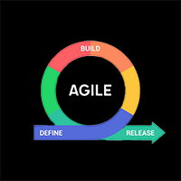

<h2 align='center'>Saibhreas<h2>
<h3 align='center'>Full Stack  Development Services<h3>

     
  
      

    
  
    
  

✨ Front End:

  Web development or site remodeling  using HTML5, CSS3 and JavaScript. 
   
  Dynamic sites that pop with REACT.
   

👨‍💻 Back End:      

  MySql, NoSql ... no problem.  
   
  Then there's GraphQL to take your data front to back, quickly with queries that make sense to the client.
   

🎪 Where the magic happens: 

                  

Insomnia or Workbench, Compass, Robo-t or Atlas on line, familiar tools integrated with VS Code editor to insure development takes place in the right environment for successful project completion.

  All Sites, apps and modules are created using the AGILE model.  From the start they are built with the idea that they will grow and be adapted to meet the changing needs

