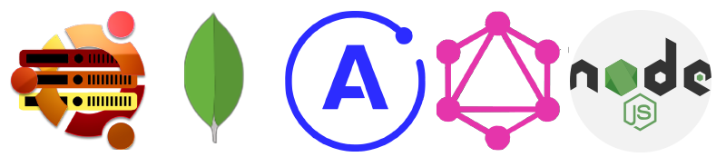

  

<h2 <h2 align='center'>Saibhreas<h2>
<h3 align='center'>Umbutu VPS Mongo DB Apollo GraphpQL Reactql Node.JS</h3>
  

 Current Project is a complete a complete build from scratch.

Startinng with  Umbuntu unmanaged VPS.  I thought Umbuntu was a google font, <em>(dyslexia)</em>.  This is an endeavor to branch out to build an App that if full functional, deployed on it's home, with minimal restraints on data.

Goal, is to take a previous poorly formed mysql project, convert to MongoDB. Incorporate Apollo Graph QL to handle API and manage data transfers. React, with integrated Graph Ql to handle client requests and display dynamically.

I will  supply a BuildReadMe.md and links once the repo is established.  And I will update the gist with links with images, and links appropriate.

  Build Beginning

Purhcased unmanged VPS  
Set it up using instructions for installing Umbuntu  
Figured out I know thing about how to communicate with this machine.

 
 

 Installed Solar Putty
 

 1> Solar PuTTY to connects to server, used command line to create user (server name on unmanged VPS).  

 2> Installed 

      vsftpd : software for secure ftp
      **Install node**
        wget -qO- https://deb.nodesource.com/gpgkey/nodesource.gpg.key | sudo apt-key add -
        $ echo 'deb https://deb.nodesource.com/node_14.x focal main' | sudo tee -a /etc/apt/sources.list
        sudo apt update
        sudo apt install -y nodejs

      **install MongoDB**

      $ wget -qO- https://www.mongodb.org/static/pgp/server-4.4.asc | sudo apt-key add -

3> Created playground

     mkdir -p playground1 && cd playground1

    npm init -y
    npm install apollo-server graphql
     touch index.js

**************************************************
As afar as it goes!
Check back soon!